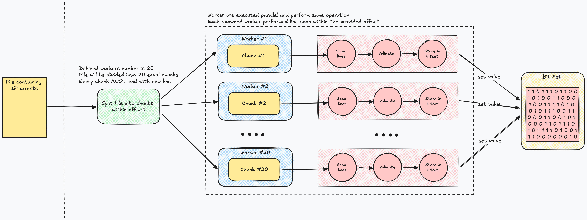

# ipuniq
Unique IP address counter from file

## Task Requirement
You have a simple text file with IPv4 addresses. One line is one address, line by line:

```
145.67.23.4
8.34.5.23
89.54.3.124
89.54.3.124
3.45.71.5
...
```

The file is unlimited in size and can occupy tens and hundreds of gigabytes.

You should calculate the number of __unique addresses__ in this file using as little memory and time as possible.
There is a "naive" algorithm for solving this problem (read line by line, put lines into HashSet).
It's better if your implementation is more complicated and faster than this naive algorithm.

## Overview
This project is designed for efficiently processing large datasets, specifically files containing IP addresses, by utilizing advanced techniques like bitset and parallel processing. It focuses on maximizing performance, minimizing memory usage, and ensuring scalability. The key problem it addresses is the need to count distinct IP addresses from massive files, which could otherwise overwhelm memory and CPU resources in a serial or inefficient implementation. The target is this 120GB [file](https://ecwid-vgv-storage.s3.eu-central-1.amazonaws.com/ip_addresses.zip).

### Low-level overview


### Key Concepts
One important part of the project is parallel execution. Large files take a long time to process when handled sequentially, so  I decided to use workers (20 parallel workers in this case). By splitting the file into chunks and assigning each chunk to a separate worker, the workload is spread across available CPU cores. Splitting a file randomly can cause issues, especially when the data (in this case, IP addresses) crosses chunk boundaries. To handle this, the file is split into offset-based chunks. Each worker receives a portion of the file, defined by start and end offsets. To ensure no data is lost or misread, the app adjust the offsets so that no IP address is split between two chunks. Adjustment is done by shifting the end offset to the nearest new line character. 

### Approaches
Initially, I experimented with using sync map to track distinct IP addresses. This approach waw far from ideal in terms of memory efficiency (see in `ROOT/set/set.go`). Map consumed too much memory, especially when processing very large files with millions of IPs. 

Then I created my own custom bitwise set (see in `ROOT/set/bitwiseset.go`), but I was slow because of mutexes. After evaluating these options, I chose to use the [github.com/bits-and-blooms/bitset](https://github.com/bits-and-blooms/bitset) package instead, as it offered a more optimized and memory-efficient way to store and check IP addresses. bits-and-blooms/bitset is a compressed set and requires less memory and is better with bitwise operations. Also, this resolves a problem of storing the IP address in open form. I convert IP address into the `uint32` to save space. The string representation of the IP address is maximum 15-bytes. The `uint32` representation of the same IP is only 4-bytes. 

#### my custom bitwise set
```
2024/09/09 11:30:26 Memory usage before function: HeapAlloc: 0.16 MB, Sys: 6.64 MB, GC cycles: 0, Goroutines: 2
2024/09/09 11:52:21 Memory usage after function: HeapAlloc: 850.33 MB, Sys: 1164.97 MB, GC cycles: 223, Goroutines: 2
2024/09/09 11:52:21 Finished execution: 21m55.007294625s
2024/09/09 11:52:23 Distinct IPs count: 1000000000
```

#### bits-and-blooms/bitset
```
2024/09/09 12:25:31 Memory usage before function: HeapAlloc: 0.16 MB, Sys: 6.39 MB, GC cycles: 0, Goroutines: 2
2024/09/09 12:27:05 Memory usage after function: HeapAlloc: 753.49 MB, Sys: 1164.78 MB, GC cycles: 223, Goroutines: 2
2024/09/09 12:27:05 Finished execution: 1m33.875564542s
2024/09/09 12:27:05 Distinct IPs count: 1000000000
```

## Disclaimer
You might notice a data race when using github.com/bits-and-blooms/bitset due to concurrent access. However, in this specific case, it is not problematic because the bitset only stores keys (representing the IP addresses), and there are no overwrites happening. This makes the race condition less risky, as no existing data gets modified once an IP is inserted. Therefore, while a data race warning may appear, it doesn’t impact the correctness of the program.

## Example Usage
```
go run main.go -file=<rout to the file>
```